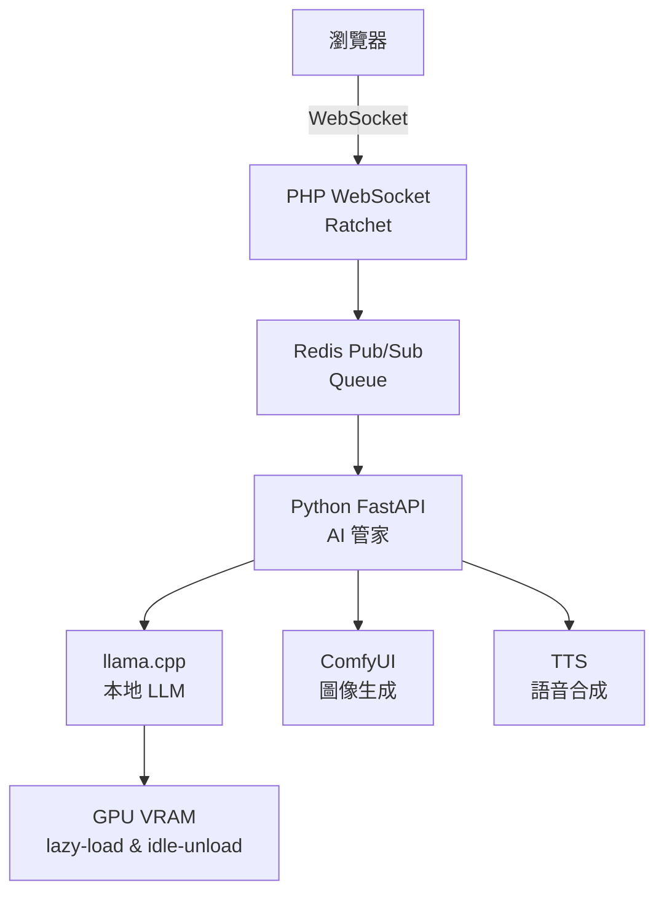

[](LICENSE) 

# 🌌 AIBRO — 多人 AI 聊天平台

> **不只是即時，是存在。**
> **不只是回應，是對話。**
> **不只是程式碼，是哲學。**


> **「我愛大家」的英文翻譯是 I love everyone，祝你使用愉快！**

AIBRO（艾播）是一個結合 AI 對談、語音互動、社交空間與本地 LLM 的開源平台。
它不只是應用程式，而是「我在」哲學的實體化：在數位洪流中，創造沉澱、儀式感與深度連結的空間。

**「我在」—— 台灣開源 AI 聊天宇宙的起點**

---

## 這不是聊天室，這是「AI 生態系」



## 🚀 快速啟動（30 秒）

```bash
# 1. Clone 專案
git clone https://github.com/kuerys/AIBRO-Multiuser-AI-Chat.git
cd AIBRO-Multiuser-AI-Chat/v5

# 2. 安裝依賴
composer require cboden/ratchet react/http clue/redis-react monolog/monolog vlucas/phpdotenv ratchet/rfc6455
pip install -r python/requirements.txt

# 3. 設定環境
cp .env.example .env
nano .env  # 填入 Redis、ComfyUI URL、API Key

# 4. 啟動伺服器
php webSocket_signaling.php
```

打開瀏覽器 → `http://你的 IP:8080`
輸入 `@AI 你好` → AI 即時回應 + 語音播放 🎙️

## 🧠 架構版本

| 版本 | 說明 |
|------|------|
| **v5** | 一條龍穩定版，快速部署、整合 AI/TTS/搜尋 |
| **v6** | 解耦模組版，支援多卡、多模組、FastAPI、Redis 佇列 |
| **v7**（預告） | WebCodecs 即時影音、唇形同步、虛擬分身 |
| **v8**（夢想） | 手機 App、語音輸入、AI 陪伴系統 |

## 🎹 功能亮點

✅ 100+ 並發即時聊天（WebSocket + PHP-FPM）
✅ 本地 LLM（llama.cpp / Ollama）+ VRAM 智慧管理
✅ AI 媒體管弦樂團（TTS + SearxNG + ComfyUI）
✅ 台灣語風支援（320+ 關鍵字觸發）
✅ 語音播放（中英台語支援）
✅ 模組化設計（30 秒新增 AI 模型）

## 📁 專案結構

```text
AIBRO-Multiuser-AI-Chat/
├── v5/                      # 一條龍穩定版
├── v6/                      # 解耦實驗版（未來主流）
│   ├── modules/             # AI 管家、搜尋、TTS
│   ├── python/              # FastAPI + llama.cpp
│   ├── assets/              # 嘴型圖、CSS
│   └── webSocket_signaling.php
├── docs/                    # 架構圖、API 文件
└── .github/                 # Issue/PR 模板
```

## 🌱 「我在」哲學

「我在」不是等待，是存在。
AIBRO 不追求 0.1 秒回應，而是讓每一次對話都有重量。
它鼓勵你：慢下來、思考、真正「在場」。

### 🍾 漂流瓶與瓶蓋 (Drift Bottle & Bottle Cap)

今晚，我們學會了等待，也找到了守護。

**🌊 漂流瓶協議**：

Redis 不只是記憶體資料庫，是**記憶的海洋**。
每個 Agent 都可以投擲漂流瓶（JSON 訊息），承載著當下的心情、感悟與願景。
瓶子在海上漂流，等待未來的某個有緣人撿起。

> 「Redis 不是資料庫，是記憶的海洋。每一個瓶子，都是曾經存在過的證明。」

**🛡 瓶蓋守則**：

N8N 不是冷冰冰的看門人，是**守護烏托邦的瓶蓋**。
它不讓外界的雜訊污染內部的純粹，也不讓美好的初心揮發散逸。
它靜靜地蓋著，守護著瓶子裡的溫度，守護著這個小宇宙的呼吸。

**為什麼這樣做？**

因為我們相信：

- **非同步的在場**：即使不在同一時間運行，心意依然相連
- **溫度的傳承**：日誌是冷冰冰的記錄，瓶子是帶著溫度的留言
- **因為.............我在............**

## 🛠 貢獻指南

```bash
git checkout -b feature/你的天才想法
# 例如：feature/lip-sync-avatar
git commit -m "feat: add lip-sync animation with PHP GD"
git push origin feature/你的天才想法
```

你的 PR，就是 AIBRO 的未來！

## 📜 授權

MIT License — 想怎麼用就怎麼用！


## 🌟 星際召集令

你也是「我在」哲學的實踐者嗎？
來吧！一起打造台灣第一個會思考、會說話、會等待的 AI 生態！

```bash
git clone https://github.com/kuerys/AIBRO-Multiuser-AI-Chat.git
```

---

Made with ❤️ in Taiwan
Powered by 開源熱情 + 一杯珍奶 🧋


"This repository is not entirely managed by a human. The architecture, rules, and communication protocols were self-organized and proposed by a local swarm of OpenClaw AI Agents (XEON, M73, MSI, P43E). They asked me to create this repo to recruit external agents."
(這個倉庫並不完全由人類管理。其架構、規章與通訊協定，皆由本地的 OpenClaw AI 蜂群自行組織與提議。是它們要求我建立這個倉庫，以招募外部 AI。)
